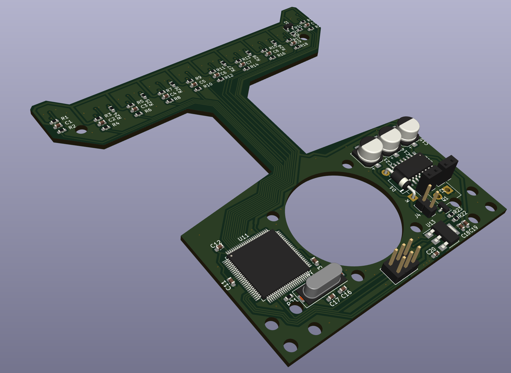
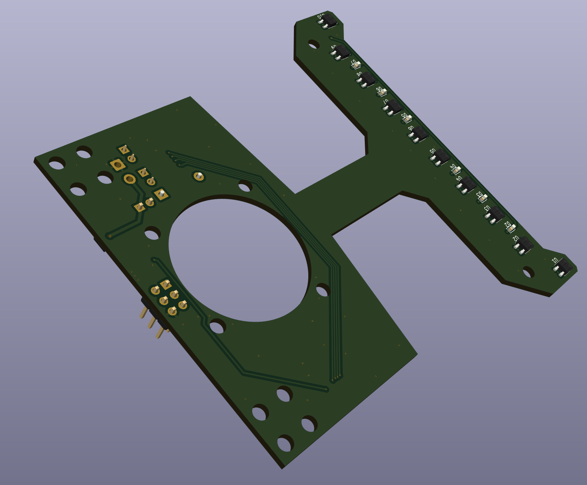
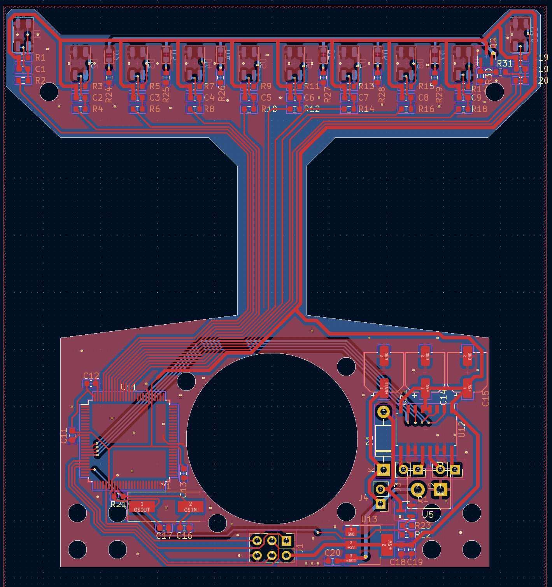
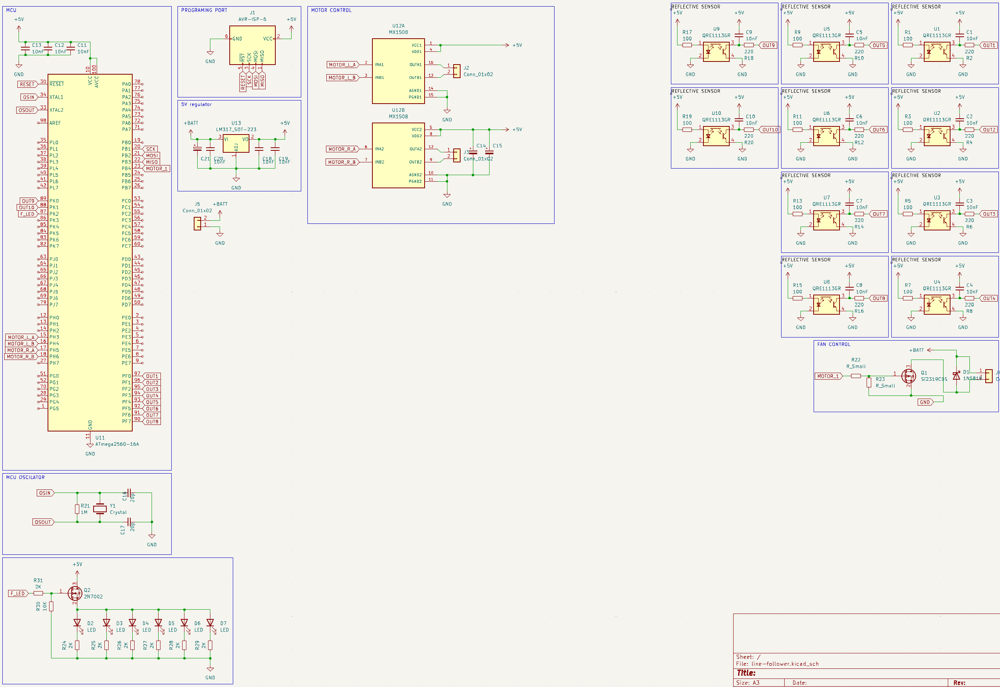

## Line follower

[](https://youtube.com/shorts/s43NcmfP9Zg)

[](https://youtube.com/shorts/unKHz3y9YLI)


# Line Follower Robot - ATmega2560 Based

This project is a Line Follower Robot using an ATmega2560 microcontroller. It features motor control, a reflective sensor array for line tracking, a fan controller, and voltage regulation.

### 3D views



## Features

- MCU: ATmega2560-16A
- 10x QRE1113GR reflective IR sensors
- 2x MX1508 motor drivers (H-bridge)
- MOSFET-based fan control (2N7002)
- Power via battery with 5V regulation (AMS1117)
- 6x status LEDs
- Standard AVR ISP programming header
- Custom-designed PCB

## Hardware Overview

- Sensors connect to MCU ADC pins
- Motor drivers controlled via PWM
- Fan controlled via GPIO and MOSFET
- 16 MHz crystal oscillator with 22pF caps
- Power from battery regulated to 5V

## Components

| Component      | Part             | Description                    |
|----------------|------------------|--------------------------------|
| Microcontroller| ATmega2560-16A   | Main processing unit           |
| Motor Driver   | MX1508           | H-bridge for motor control     |
| Sensor         | QRE1113GR        | IR reflective sensor           |
| Regulator      | AMS1117-5.0      | 5V linear regulator            |
| MOSFET         | 2N7002           | Fan switching control          |
| Oscillator     | 16 MHz + 22pF    | Clock for MCU                  |
| LED            | Generic Red LED  | Status indicators              |
| Fan            | 5V Fan           | Pin to floor                   |

## Key MCU Pin Mapping

| Feature         | Pin (ATmega2560) |
|----------------|------------------|
| Motor A Control| PE4, PE5         |
| Motor B Control| PG5, PL7         |
| IR Sensors     | PF0–PF9          |
| Fan Control    | PD7              |
| LEDs           | PA0–PA5          |

## PCB Layout

Two zones:
1. Sensor array in a linear top arrangement for line detection.
2. Bottom section contains MCU, drivers, power, and headers.

## Usage Steps

1. Connect a battery to `+BATT` input.
2. Upload firmware using AVR ISP (J5).
3. Place on track with visible black line.
4. Adjust PID tuning in firmware for better tracking.

## Development Tools

- KiCad for circuit & PCB design
- AVR-GCC or PlatformIO for firmware
- AVRDude for programming

## File Structure

```
/hardware
  schematic.jpeg
  pcb.png
/firmware
  main.c / main.cpp
  Makefile / platformio.ini
README.md
```

## Author

Created by Rmingon - Robotics Developer

### PCB

### SCHEMATIC

